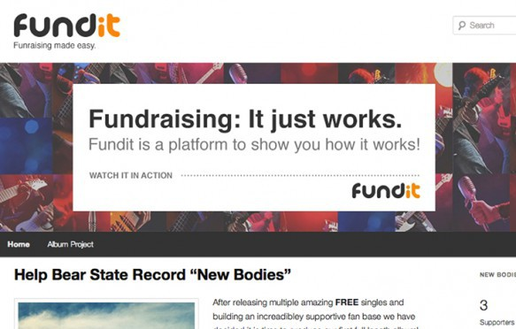
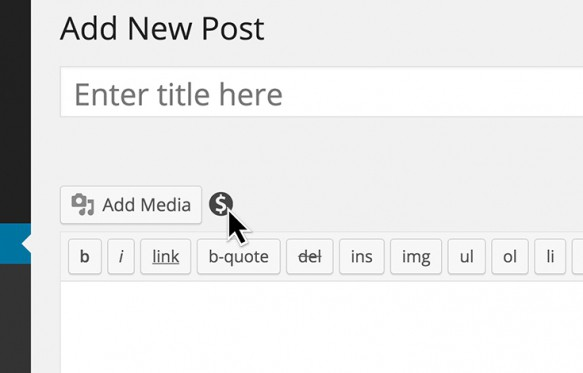
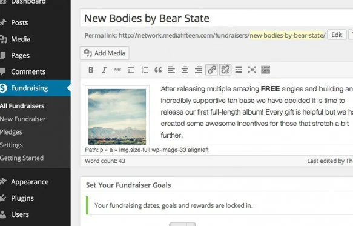

<h2 align="center" style="color:#38c2bb;">📚 PS Fundraising</h2>

 
  <a href="https://github.com/cp-psource/ps-fundraising/discussions" style="color:#38c2bb;">💬 Forum</a> 
  <a href="https://github.com/cp-psource/msreader/releases" style="color:#38c2bb;">📝 Download</a>

**Erstelle Spendenbuttons, komplexe Crowdfundingkampagnen oder lasse Deine Besucher Deine Projekte unterstützen.**

## Crowdfunding für Dein nächstes Projekt mit Finanzierungszielen und Belohnungspaketen oder Erstellen einer einzelnen Spendenseite mit wiederkehrenden Zahlungsoptionen.

 

Erstelle, hoste und verwalte Deine Spendenaktionen und behalte alle Erlöse.

### Mehr Geld für Ihr Projekt

Bei Diensten wie Kickstarter und Indiegogo fallen Verwaltungs- und Bearbeitungsgebühren von bis zu 11 % an. Verzichte auf die unverschämten Gebühren und stecke das Geld stattdessen direkt in Deine gemeinnützige Organisation, Indie-Plattenveröffentlichung oder verrückte Erfindung.

### Leistungsfunktionen und einfache Einrichtung

Wenn Du nach einem leistungsstarken Fundraising-System mit Tausenden von Einstellungen suchst, ist dies nicht das Richtige. Andere Plugins können das tun. Fundraising bietet genau die leistungsstarken Funktionen für einfaches Crowdfunding und eine schnelle Einrichtung.

 

Alle wichtigen Funktionen zum einfachen Verwalten einer Spendenaktion auf Deiner Webseite.

 

Füge mit dem Shortcode-Generator schnell Fundraising-Funktionen in jeden Beitrag ein.

### In Dein Theme integrieren

Mit dem einfachen Leitfaden „Erste Schritte“ kannst Du sofort Spendenaktionen erstellen. Fünf enthaltene Stilvorlagen, der In-Post-Shortcode-Generator und integrierte Widgets erleichtern die Integration in Dein bestehendes Theme.

### Einfache Zahlungsabwicklung

Das Fundraising umfasst zur Vereinfachung die Paypal-Integration oder ermöglicht es Dir, 100 % der Spende mit einer manuellen Verarbeitungsoption zu behalten. Beobachte wie Dein Fortschrittsbalken steigt. Verarbeite Geschenke in Echtzeit bei Deiner nächsten Veranstaltung. Gib Geldgeschenke, Kreditkarten und Zusagen ein.

### Belohnungen und Meilensteine

Lege ein Start- und Enddatum mit einem bestimmten Ziel fest und warte mit der Zahlung, bis das Projekt finanziert ist, oder nimm Spenden entgegen, sobald sie eingehen. Erstelle Prämienpakete und begrenze die Verfügbarkeit, um potenzielle Unterstützer zu motivieren. Fundraising macht es einfach!

 

Biete Belohnungen an, um Benutzer zu einer schnellen Reaktion zu inspirieren

### PS Fundraising

**Erstelle eine Spendenseite für jeden Zweck oder jedes Projekt..**

**Einfache Spenden**

Nimm kontinuierliche Spenden ohne Enddatum entgegen. Ideal für gemeinnützige Organisationen und von Spendern unterstützte Organisationen.

**Erweitertes Crowdfunding**

Genehmige Zuschüsse und warte dann mit der Zahlungsabwicklung, bis Dein Ziel erreicht ist – wie bei Kickstarter.

**Anzeigestile**

Wähle einen der enthaltenen Stile (Basic, Dark, Fresh, Minimal, Note) oder erstelle einen benutzerdefinierten Stil.

**Start- und Enddatum**

Plane Dein Start- und Enddatum, um bei zeitkritischen Projekten Dringlichkeit zu schaffen.

**Vielen Dank und Follow-up**

Integrierte automatische Antwort-E-Mails senden Dankesnachrichten und Bestätigungs-E-Mails.

**Belohnung**

Lege Unterstützungsstufen fest und belohne Spender mit einem Aufkleber, einem T-Shirt oder einer vorzeitigen Veröffentlichung Deines Bildbandes, je nachdem, wie viel sie spenden.

### Benutzerzugriffskontrolle

Mit einem Team arbeiten? Erteile jeder Benutzerebene die Berechtigung, nur auf die Fundraising-Funktionen zuzugreifen, die sie benötigen. Von der Verwaltung von Benutzern und Spendenaktionen bis hin zu Zusagen und Einstellungen.

### Crowdfunding-Netzwerk

Fundraising ist für die Verwendung mit WordPress, Multisite und BuddyPress konzipiert. Werde kreativ und kombiniere Fundraising mit anderen gut codierten Plugins – wie [PS Bloghosting](https://cp-psource.github.io/ps-bloghosting/). Baue und hoste Dein eigenes fantastisches Crowdfunding-Netzwerk. Erhebe eine Prämie für die Möglichkeit, Kampagnen durchzuführen.